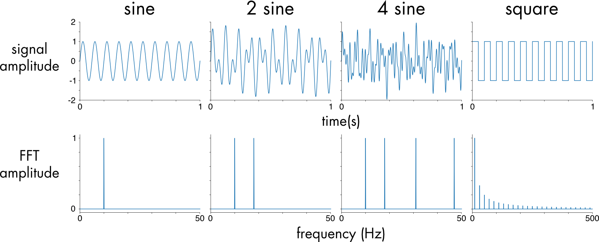
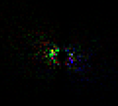

## Introduction

We all know how beautiful water is and can be. I know I could stare at an ocean for hours just relaxing, watching the waves take shape slowly and then break down quickly while leaving behind nothing but foam and bubbles. Of course, because water is so cool and it has some very intriguing physical properties, our jobs as Graphics Programmers when it comes to Water Rendering can become quite difficult. Indeed, it does depend on how *deep* (pun intended :p) you are planning to go. In some cases you might be able to get away with just a flat plane and some scrolling textures, or a couple of sinusoidal waves acting upon the vertices of said plane. Well, in case you are wondering how AAA Games (and Movies too!) take on this challenge, look no further! I will be detailing how I implemented the famous Tessendorf Model for Ocean Rendering, in a PS5 Custom Engine Project for one of my 2nd Year University Assignments.

*Note: Sony, if you are reading this, first of all thank you :) and second of all, don't worry, I've made sure not to squeeze in any PS5 specific code*

## Tessendorf's Model
### High Level Overview

You might be asking yourself right about now something along the lines of "Who is Tessendorf and what did he Model?", which would be valid. To put it frankly, Jerry Tessendorf is basically the God of Ocean Simulation. In 2001 he released the Scientific Paper named "Simulating Ocean Water", where he discusses a method which was being used heavily in feature films at that time such as *Titanic (1997)*. Here are a couple of Movies that make use of Tessendorf's Model, or a similar approach: *Pirates of the Caribbean (2003-2017)*, *Moana (2016)*, *Life of Pi (2012)*. As for Games, here are a few: *Assassin's Creed IV: Black Flag (2013)*, *Sea of Thieves (2018)*, *ATLAS (2018)*. "Cool cool, but how does it actually work?" I hear you say?

Well here's a high-level overview. Tessendorf tells us that this method is based on statistical modelling of ocean waves with real life data, which in practice means that we use an Oceanographic Spectrum to generate displacement (and normals) for our plane. This spectrum represents a collection of sinusoidal functions that are defined in the **Frequency Domain** (Figure 1). After we evolve this Spectrum through time (to give the water the visual queue of movement) we can apply an **Inverse Fourier Transform** to convert back to the **Spatial Domain** (Figure 1). Finally, we can then calculate the Displacement and Slope (used for the Normals) maps. We can break this down into 5 "simple" steps:
1. Generate Ocean Spectrum
2. Advance Spectrum through time
3. Convert to Spatial Domain
4. Generate Displacement and Slope maps
5. "Lights, Waves, Action!"

{: w="800" h="600" } _Figure 1: Sinusoidal functions represented in the time domain (top) and in the frequency domain (bottom)_ 

### Step 1 - Generate Ocean Spectrum

There are a lot of options to choose from when it comes to Oceanographic Spectra. I decided to use the JONSWAP Spectrum, which is based on the Phillips Spectrum (the same spectrum used by Tessendorf). The JONSWAP Spectrum has a few more parameters than the Phillips Spectrum and it can theoretically produce more accurate oceans. Speaking of parameters, let's see what this spectrum looks like in it's mathematical form and explain it's parameters:

$$

    S(f) = \alpha \frac{g^2}{(2\pi)^4 f^5} \exp\left(-\frac{5}{4} \left(\frac{f_p}{f}\right)^4\right) \gamma^{r(f)}

$$

  

Where:

- $f$: Wave frequency (Hz), also known as *omega*.

- $f_p$: Peak frequency (Hz), also known as *peak omega*, where the spectrum reaches its maximum.

- $g$: Acceleration due to gravity ($\approx 9.81$ $m/s^2$).

- $\alpha\ (\text{alpha})$: Dimensionless scaling factor (Phillips constant), which is related to the wave energy level.

- $\gamma\ (\text{gamma})$: Peak enhancement factor, typically ranging from 1 to 7, characterizing the sharpness of the spectrum peak.

- $r(f)$: Peak shape function, defined as:

  

$$

    r(f) = \exp\left(-\frac{(f - f_p)^2}{2 \sigma^2 f_p^2}\right)

$$

  Where:

- $\sigma\ (\text{sigma})$: Width parameter, which depends on the frequency:

  

$$

\sigma =

\begin{cases}

\sigma_a & \text{if } f \leq f_p \\

\sigma_b & \text{if } f > f_p

\end{cases}

$$

And:
- $\sigma_a$ = 0.07
- $\sigma_b$ = 0.09

In C++, it would look something like this:
```c++
struct JonswapParameters
{
    float gamma = 0.0f;
    
    float alpha = 0.0f;
    float peakOmega = 0.0f;
    // More to come later...
};
```

*A short note on Code Implementation: Since I wrote this using the PS5 api, I won't be sharing any api or shader specific code. Instead, I will be providing a mix between C++ and Pseudocode that should be enough to get you going in your desired api. I should also mention that my implementation is heavily based on Acerola's in Unity. He has some great videos on YouTube that I recommend you watch. Check the Bibliography for them!*

Speaking of code, we haven't discussed how we will approach all these steps. The best thing we can do is to write most of our computations in Compute Shaders. Doing this on the CPU would not be reliable in a Real-Time application. So how does one store these "spectrums", displacement maps and slope maps? Well, the answer is **Textures**. We want 16bit per channel float precision (i.e **RGBA16Float**) for more accurate computations. We also need it to be signed, as the data can very well be negative. As for the texture size, it should be powers of 2. I went with 512x512 for this simulation. Without further ado, I present you with the first compute shader of this voyage! We compute the **Initial Spectrum**, once per parameter change (not once per frame), like so:

```hlsl
// Compute Initial Spectrum
// Adapted from: https://github.com/GarrettGunnell/Water

float DispersionRelation(float kMag) 
{
    return sqrt(G * kMag * tanh(min(kMag * computeParams->depth, 20)));
}

float DispersionDerivative(float kMag) 
{
    float th = tanh(min(kMag * computeParams->depth, 20));
    float ch = cosh(kMag * computeParams->depth);
    return G * (computeParams->depth * kMag / ch / ch + th) / DispersionRelation(kMag) / 2.0f;
}

float NormalizationFactor(float s) 
{
    float s2 = s * s;
    float s3 = s2 * s;
    float s4 = s3 * s;
    if (s < 5) return -0.000564f * s4 + 0.00776f * s3 - 0.044f * s2 + 0.192f * s + 0.163f;
    else return -4.80e-08f * s4 + 1.07e-05f * s3 - 9.53e-04f * s2 + 5.90e-02f * s + 3.93e-01f;
}

float Cosine2s(float theta, float s) 
{
	return NormalizationFactor(s) * pow(abs(cos(0.5f * theta)), 2.0f * s);
}

float SpreadPower(float omega, float peakOmega) 
{
	if (omega > peakOmega)
		return 9.77f * pow(abs(omega / peakOmega), -2.5f);
	else
		return 6.97f * pow(abs(omega / peakOmega), 5.0f);
}

float DirectionSpectrum(float theta, float omega) 
{
	float s = SpreadPower(omega, jonswapParams->peakOmega) + 16 * tanh(min(omega / jonswapParams->peakOmega, 20)) * jonswapParams->swell * jonswapParams->swell;
	
	return lerp(2.0f / 3.1415f * cos(theta) * cos(theta), Cosine2s(theta - jonswapParams->angle, s), jonswapParams->spreadBlend);
}

float TMACorrection(float omega) 
{
	float omegaH = omega * sqrt(computeParams->depth / G);
	if (omegaH <= 1.0f)
		return 0.5f * omegaH * omegaH;
	if (omegaH < 2.0f)
		return 1.0f - 0.5f * (2.0f - omegaH) * (2.0f - omegaH);
	
	return 1.0f;
}

float JONSWAP(float omega) 
{
	float sigma = (omega <= jonswapParams->peakOmega) ? 0.07f : 0.09f;
	
	float r = exp(-(omega - jonswapParams->peakOmega) * (omega - jonswapParams->peakOmega) / 2.0f / sigma / sigma / jonswapParams->peakOmega / jonswapParams->peakOmega);
	
	float oneOverOmega = 1.0f / (omega + 1e-6f);
	float peakOmegaOverOmega = jonswapParams->peakOmega / omega;
	return jonswapParams->scale * TMACorrection(omega) * jonswapParams->alpha * G * G
		* oneOverOmega * oneOverOmega * oneOverOmega * oneOverOmega * oneOverOmega
		* exp(-1.25f * peakOmegaOverOmega * peakOmegaOverOmega * peakOmegaOverOmega * peakOmegaOverOmega)
		* pow(abs(jonswapParams->gamma), r);
}

float ShortWavesFade(float kLength) 
{
	return exp(-jonswapParams->shortWavesFade * jonswapParams->shortWavesFade * kLength * kLength);
}

[numthreads(8, 8, 1)]
void main(uint2 threadID)
{
	float halfN = SPECTRUM_TEX_SIZE / 2.0f;
	
	float2 gauss1 = GetGaussianRandNumber();
	float2 gauss2 = GetGaussianRandNumber();
	
	float deltaK = 2.0f * PI / LENGTH_SCALE;
	float2 K = (threadID.xy - halfN) * deltaK;
	float kLength = length(K);
	if (lowCutoff <= kLength && kLength <= highCutoff)
	{
		float kAngle = atan2(K.y, K.x);
		float omega = DispersionRelation(kLength);
		float dOmegadk = DispersionDerivative(kLength);
		
		float spectrum = JONSWAP(omega) * DirectionSpectrum(kAngle, omega) * ShortWavesFade(kLength);
		
		initial_spectrum[threadID.xy] = float4(float2(gauss2.x, gauss1.y) * float2(sqrt(2 * spectrum * abs(dOmegadk) / kLength * deltaK * deltaK)), 0.0f, 0.0f);
	}
	else
	{
		initial_spectrum[threadID.xy] = float4(0.0f, 0.0f, 0.0f, 0.0f);
	}
}
```

This needs some unpacking to do, so let's break it down:
- `deltaK` is used to discretize the frequency domain
- `K` represents the number of waves vector for that sample
- `kLength` is used later on in the Dispersion Relation calculation
- `DispersionRelation() & DispersionDerivative()` calculates the dispersion relation, as defined by Tessendorf. This is crucial for Energy conservation. It also tells us how the ocean acts at different depths and wave lengths
- `JONSWAP()` calculates the initial spectrum
- `DirectionSpectrum()` calculates a value which is used to influence the waves in a user-defined wind direction 
- `ShortWavesFade()` is used to influence the amount of short waves present in the simulation. a low value will lead to very detailed and rough oceans, whereas a high value will result in smoother and leaner oceans

Let us revisit the `JonswapParameters` struct after we've gained all this information:
```c++
struct JonswapParameters
{
    float scale = 0.0f; // Used to scale the Spectrum [1.0f, 5.0f] --> Value Range
    float spreadBlend = 0.0f; // Used to blend between agitated water motion, and windDirection [0.0f, 1.0f]
    float swell = 0.0f; // Influences wave choppines, the bigger the swell, the longer the wave length [0.0f, 1.0f]
    float gamma = 0.0f; // Defines the Spectrum Peak [0.0f, 7.0f]
    float shortWavesFade = 0.0f; // [0.0f, 1.0f]

    float windDirection = 0.0f; // [0.0f, 360.0f]
    float fetch = 0.0f; // Distance over which Wind impacts Wave Formation [0.0f, 10000.0f]
    float windSpeed = 0.0f; // [0.0f, 100.0f]
    
    float angle = 0.0f;
    float alpha = 0.0f;
    float peakOmega = 0.0f;
};
```

In a function, after the other parameters have been set by the user, we can calculate the `angle`, `alpha`, and `peakOmega`. Here's how:

```c++
float JonswapAlpha(float fetch, float windSpeed) { return 0.076f * pow(9.81f * fetch / windSpeed / windSpeed, -0.22f); }
float JonswapPeakFrequency(float fetch, float windSpeed) { return 22 * pow(windSpeed * fetch / 9.81f / 9.81f, -0.33f); }

void UpdateParameters()
{
	// User updates other parameters...
	
	jonswapParams.angle = jonswapParams.windDirection / 180.0f * glm::pi<float>();
	jonswapParams.alpha = JonswapAlpha(jonswapParams.fetch, jonswapParams.windSpeed);
	jonswapParams.peakOmega = JonswapPeakFrequency(jonswapParams.fetch, jonswapParams.windSpeed);
}
```

#### Step 1.5 - Pack Spectrum

Now that we have generated a Spectrum Texture, we need to get ready to convert our data to the **Spatial Domain**. As per Tessendorf's Paper, we have now generated $\tilde{h}_0$, where:

$$ \tilde{h}_0(\mathbf{k}) = \frac{1}{\sqrt{2}} (\xi_r + i \xi_i) \sqrt{P_{\text{JONSWAP}}(\mathbf{k})}
$$

In order to propagate our waves "to the left" and "to the right", we must calculate $\tilde{h}_0^*$, the conjugate of $\tilde{h}_0$. We do so in another Compute Shader, that is also required to run only when generating the spectrum (usually when the parameters change):

```hlsl
[numthreads(8, 8, 1)]
void main(uint2 threadID)
{
    float2 h0 = initial_spectrum[threadID.xy].rg;
    float2 h0conj = initial_spectrum[uint2((SPECTRUM_TEX_SIZE - threadID.x ) % SPECTRUM_TEX_SIZE, (SPECTRUM_TEX_SIZE - threadID.y) % SPECTRUM_TEX_SIZE)].rg;

    initial_spectrum[threadID.xy] = float4(h0, h0conj.x, -h0conj.y);
}
```

You can now visualize this texture on your plane mesh, or in your Graphics Debugger. Regardless, it should look something like this:

{: w="500" h="400" } _Figure 2: Initial JONSWAP Spectrum_
Each Texel's value represents the amplitude of a wave, whereas the distance of that texel from the center of the texture represents the frequency. Also, the direction of the texel corresponds to the direction of the respective wave.
### Step 2 - Advance Spectrum

Now, we have to evolve our spectrum through time. Also, in order to generate a displacement and slope map later on, we will first split our spectrum into 2 other spectra. The **Displacement Spectrum** and the **Slope Spectrum**. For this, we will have to create 2 new Textures which have the same format as the **Initial Spectrum**. Remember, we are still in the **Frequency Domain** at this point. Tessendorf Tells us that we can propagate our waves, and hence evolve them through time, with this formula:
$$
\tilde{h}(\mathbf{k}, t) = \tilde{h}_0(\mathbf{k}) e^{-i \omega(\mathbf{k}) t} + \tilde{h}_0^*(-\mathbf{k}) e^{i \omega(\mathbf{k}) t}
$$
This generates a height amplitude field, in **Fourier Space**, which is another term for the **Frequency Domain**. We already have $\tilde{h}_0$ and $\tilde{h}_0^*$ so we still need to calculate the **Dispersion** which is the exponent of Euler's Number ($e$), in the formula presented above. Lastly, we must calculate the partial derivatives for both the **displacement** and **slope**. 

```hlsl
float2 ComplexMult(float2 a, float2 b) { return float2(a.x * b.x - a.y * b.y, a.x * b.y + a.y * b.x); }

float2 EulerFormula(float x) { return float2(cos(x), sin(x)); }

[numthreads(8, 8, 1)]
void main(uint2 threadID)
{
	const uint LENGTH_SCALE = SPECTRUM_TEX_SIZE / 8;
	
	float4 initialSignal = initial_spectrum[threadID.xy];
    float2 h0 = initialSignal.rg;
    float2 h0conj = initialSignal.ba;
    
    float halfN = SPECTRUM_TEX_SIZE / 2.0f;
    float2 K = (threadID.xy - halfN) * 2.0f * PI / LENGTH_SCALE;
    float kMag = length(K);
    float kMagRcp = rcp(kMag);

    if (kMag < 0.0001f) 
    {
        kMagRcp = 1.0f;
    }

    float w_0 = 2.0f * PI / jonswapParams->repeatTime;
    float dispersion = floor(sqrt(G * kMag) / w_0) * w_0 * time;

    float2 exponent = EulerFormula(dispersion);

    float2 htilde = ComplexMult(h0, exponent) + ComplexMult(h0conj, float2(exponent.x, -exponent.y));
    float2 ih = float2(-htilde.y, htilde.x);

	// Derivatives
    float2 displacementX = ih * K.x * kMagRcp;
    float2 displacementY = htilde;
    float2 displacementZ = ih * K.y * kMagRcp;
    float2 displacementX_dx = -htilde * K.x * K.x * kMagRcp;
    float2 displacementY_dx = ih * K.x;
    float2 displacementZ_dx = -htilde * K.x * K.y * kMagRcp;
    float2 displacementY_dz = ih * K.y;
    float2 displacementZ_dz = -htilde * K.y * K.y * kMagRcp;

    float2 htildeDisplacementX = float2(displacementX.x - displacementZ.y, displacementX.y + displacementZ.x);
    float2 htildeDisplacementZ = float2(displacementY.x - displacementZ_dx.y, displacementY.y + displacementZ_dx.x);
        
    float2 htildeSlopeX = float2(displacementY_dx.x - displacementY_dz.y, displacementY_dx.y + displacementY_dz.x);
    float2 htildeSlopeZ = float2(displacementX_dx.x - displacementZ_dz.y, displacementX_dx.y + displacementZ_dz.x);

    displacement_spectrum[threadID.xy] = float4(htildeDisplacementX, htildeDisplacementZ);
    slope_spectrum[threadID.xy] = float4(htildeSlopeX, htildeSlopeZ);
}
```

You may have noticed a new parameter that we store on the `JonswapParameters` struct. It's the `repeatTime` parameter. It tells us how quick the waves will animate, in relation to their displacement. A higher value means that the animation will happen more frequently.

```c++
struct JonswapParameters
{
	// Previous Parameters...
	float repeatTime = 0.0f; // Between [0, 200]
}
```
### Step 3 - Convert to Spatial Domain

Earlier, when I talked about how this step works, I mentioned **Fourier Transforms**. A Fourier Transform, is an algorithm used to move from the Spatial/Time Domain to the Frequency Domain. Think of it as a way of breaking down a complex signal, into multiple individual signals. Programmatically, there are two ways we can go about implementing a Fourier Transform algorithm. There is the **Discrete Fourier Transform** (DFT for short) and the **Fast Fourier Transform** (FFT for short). I will not be going into detail on either of them, as that would be a whole other article on its own. I will post some resources in the Bibliography section at the bottom in case you want to find out more ;) 

With this said, our spectrum is basically a multitude of signals, and as we have already established, we need to bring those signals over to the Spatial Domain. The answer to our troubles is nothing but the **Inverse Fast Fourier Transform**. With leaving out the implementation details of the FFT algorithm, here's how we can achieve this domain conversion in 2 separate compute shaders:

```hlsl
[numthreads(512, 1, 1)]
void VerticalFFT(uint2 threadID)
{
    displacement_spectrum[threadID.yx] = InverseFFT(threadID.x, displacement_spectrum[threadID.yx]);
    slope_spectrum[threadID.yx] = InverseFFT(threadID.x, slope_spectrum[threadID.yx]);
}

[numthreads(512, 1, 1)]
void HorizontalFFT(uint2 threadID)
{
    displacement_spectrum[threadID] = InverseFFT(threadID.x, displacement_spectrum[threadID.xy]);
    slope_spectrum[threadID] = InverseFFT(threadID.x, slope_spectrum[threadID.xy]);
}
```

### Step 4 - Generate Displacement and Slope Maps

We are now ready to generate the final Displacement and Slope Maps (which means we need another 2 extra textures to be created). All we have to do is apply a checkerboard pattern transformation to our now Spatial Domain data, which helps to keep the phase alignment of our waves correct. This is achieved by Permuting our data. We then extract the partial derivatives and calculate the displacement by the following formula: 

$$D_x = \Lambda_x \cdot \text{dxdz} \cdot x, \quad D_y = \text{dydxz} \cdot x, \quad D_z = \Lambda_y \cdot \text{dxdz} \cdot y$$

where $\Lambda_x$ and $\Lambda_y$ are scaling factors for the displacement. Also, the formula for the slopes is the following:

$$
\mathbf{S} = \frac{\text{dyxdyz}}{1 + |\text{dxxdzz} \cdot \Lambda|}
$$

```hlsl
float4 Permute(float4 data, float3 id) 
{
    return data * (1.0f - 2.0f * ((id.x + id.y) % 2));
}

[numthreads(8, 8, 1)]
void main(uint3 threadID)
{
    const float2 Lambda = float2(1.0f, 1.0f);

	float4 htildeDisplacement = Permute(displacement_spectrum[threadID.xy], threadID);
	float4 htildeSlope = Permute(slope_spectrum[threadID.xy], threadID);
	
	float2 dxdz = htildeDisplacement.rg;
	float2 dydxz = htildeDisplacement.ba;
	float2 dyxdyz = htildeSlope.rg;
	float2 dxxdzz = htildeSlope.ba;
	
	float3 displacement = float3(Lambda.x * dxdz.x, dydxz.x, Lambda.y * dxdz.y);
	float2 slopes = dyxdyz.xy / (1 + abs(dxxdzz * Lambda));
	
	displacement_texture[threadID.xy] = float4(displacement, 1.0f);
	slope_texture[threadID.xy] = float4(slopes, 0.0f, 1.0f);
}
```

### Step 5 - "Lights, Waves, Action!"

We are now "out of the woods" (meaning that the most difficult part is over) and are now ready to witness the beauty of Tessendorf's Model. All we need to do is to sample the **Displacement Map** in our Vertex Shader, and derive our Normals from our **Slope Map** in the Pixel Shader. Here's how easy that is:

```hlsl
// Vertex Shader
VertexOutput main(Vertex vert)
{
	VertexOutput Output;
	float4x4 pvm = mul(pv, model);

	float3 pos = vert.pos + displacement_texture.Sample(sampler, vert.uv).rgb;
	float3 fragPos = mul(model, float4(pos, 1.0f)).xyz;

	Output.Uv = vert.uv;
	Output.FragPosition = fragPos;
	return Output;
}

// Pixel Shader
float4 main(VertexOutput input)
{
	float4 slope = slope_texture.Sample(sampler, input.Uv);
	float3 normal = normalize(float3(-slope.x, 1.0f, -slope.y));
	
	// Lighting Calculations Here...
}
```

After slapping on a PBR Shader, you can expect results that are similar to what I managed to produce. Here is a quick showcase:

## Tweaks and Fixes

### Foam 

You may have noticed that the last showcase was missing something quite crucial, compared to the very first screenshot and video shown in this article. In case you haven't, I'll spare you having to scroll all the way up to check. I am talking about **Foam**. Tessendorf talks about how one can introduce foam in their simulation for a more natural and life-like appearance. At this method's core, we find something called **"the Jacobian"**. The Jacobian determines how much a surface has changed. Tessendorf shows us that we can use it to determine high frequency waves that break at their peak, or curl in on themselves. With this, we can then inject foam at those points. Here's a slightly different Compute Shader for Step 4:

```c++
[numthreads(8, 8, 1)]
void main(uint3 threadID)
{
	// Slope and Displacement computation 
	// ...
	
	// Foam computation
	float jacobian = (1.0f + Lambda.x * dxxdzz.x) * (1.0f + Lambda.y * dxxdzz.y) - Lambda.x * Lambda.y * dydxz.y * dydxz.y;
	
	float foam = htildeDisplacement.a;
	foam *= exp(-foamDecayRate);
	foam = saturate(foam);
	
	float biasedJacobian = max(0.0f, -(jacobian - foamBias));
	
	if (biasedJacobian > foamThreshold)
	    foam += foamAdd * biasedJacobian;

	// We now store the Foam value in the Alpha channel of the Displacement Map
	displacement_texture[threadID.xy] = float4(displacement, foam);
	slope_texture[threadID.xy] = float4(slopes, 0.0f, 1.0f);
}
```

## Future Work


## Bibliography

Figure 1: https://neurotext.library.stonybrook.edu/C7/C7_1/C7_1.html