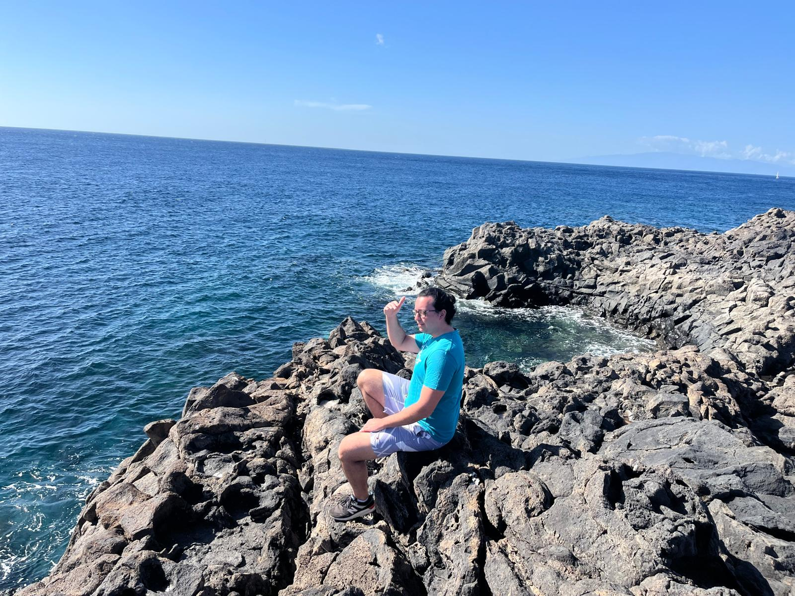

---
# the default layout is 'page'
icon: fas fa-info-circle
order: 4
---

{: w="500" h="500" .right }

## Who am I?

My name is George and I am a 20 Year Old student at Breda University of Applied Sciences, currently in Year 3. I study Game Programming and I specialize in Graphics Programming. I love a wide range of Video Games, Star Wars and Graphics!

## What is this website about?

This is my portfolio! Here, you can expect to see cool projects that I worked on and Blog Posts on interesting techniques/findings I've came across. Any feedback you may have is greatly appreciated! Feel free to reach out to me on my socials for any questions, feedback, or if you just wanna chat :)
